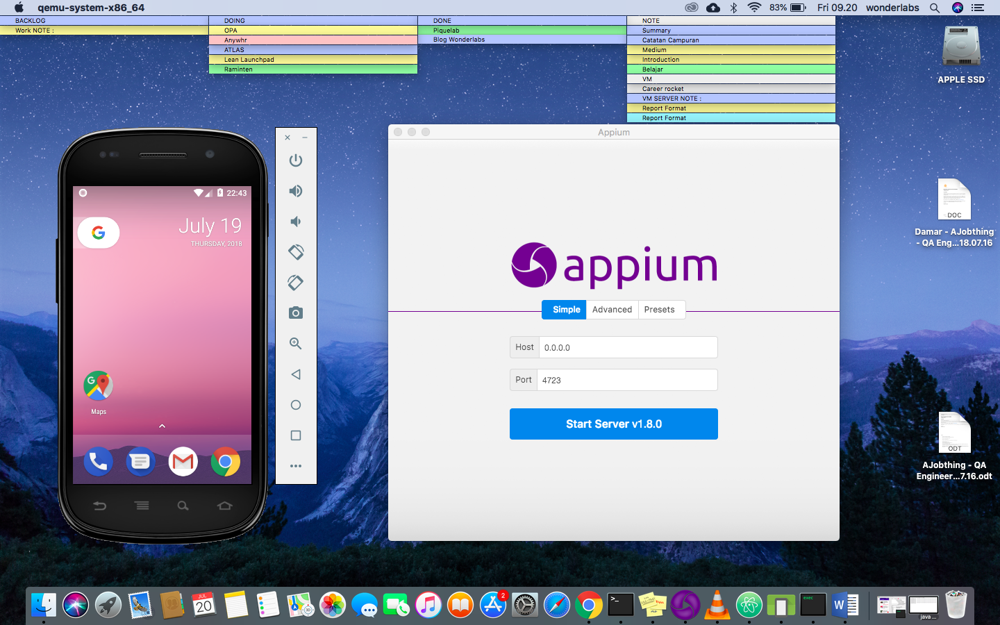
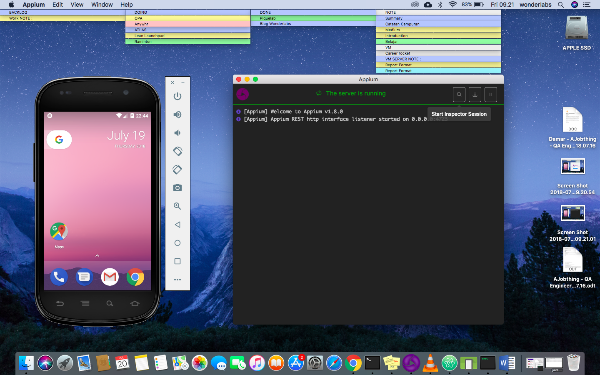
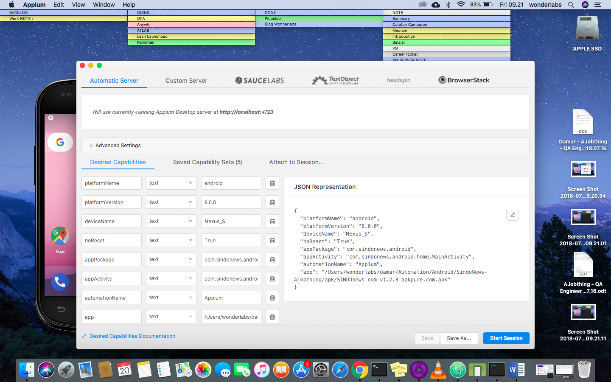
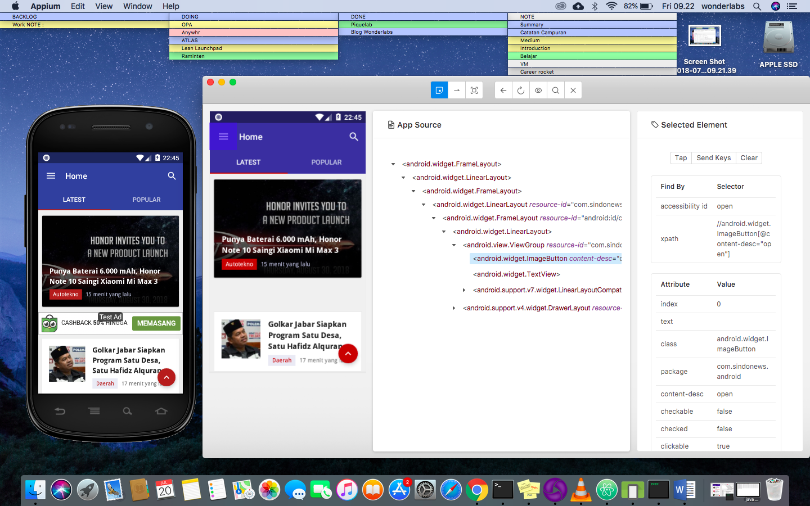
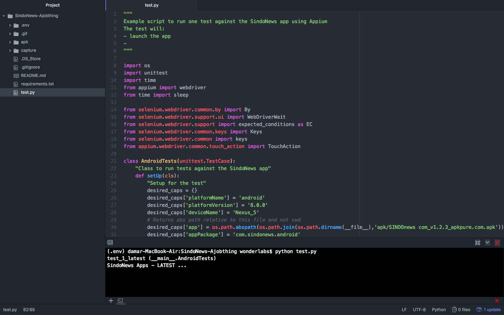
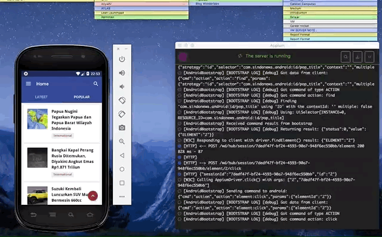

### Automation Test SINDO News app

#### Install Appium
- Version 1.6.1 (1.6.1)
- URL https://github.com/appium/appium-desktop/releases/tag/v1.6.1

#### Create Emulator
- Nexus S
- Android SDK built for x86_64
- Android 8.0.0 Oreo
- Android API 27

#### Python
1. Install pip python $ sudo easy_install pip
2. Install virtualenv $ sudo pip install virtualenv
3. Buat virtualenv folder $ virtualenv venv
4. Aktifkan env $ source venv/bin/activate
5. Install requirements $ pip install -r requirements.txt
6. Deactive virtualenv $ deactive

#### Requirements
- Appium-Python-Client==0.26
- selenium==3.11.0

### How to use

### Arguments
- $: python test.py

### GIF

